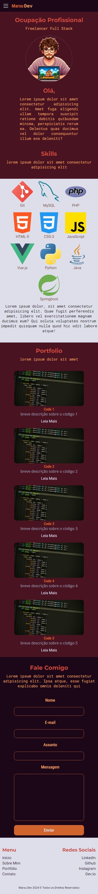
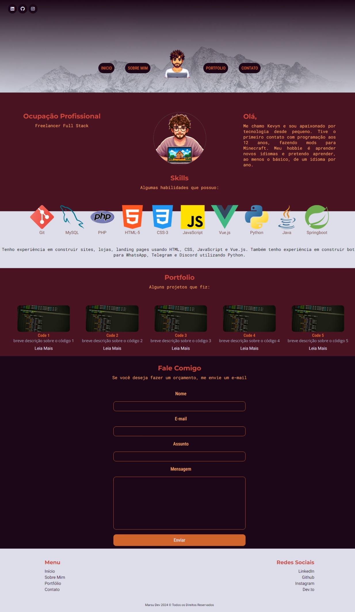
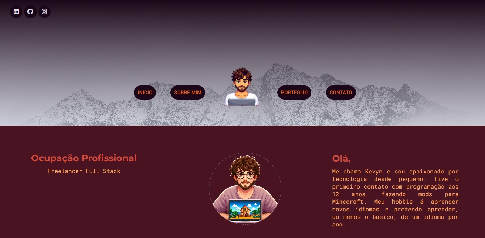
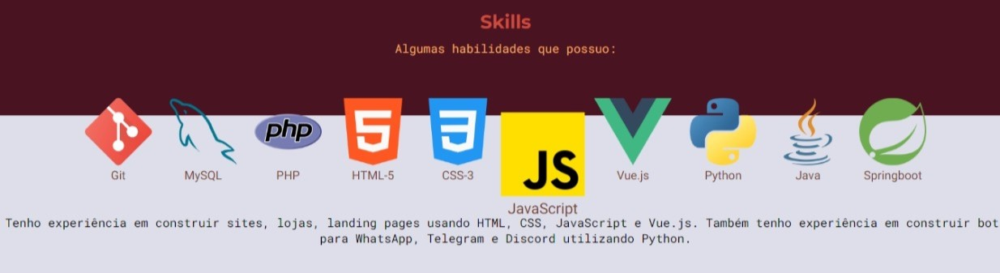
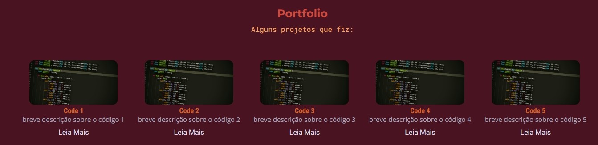
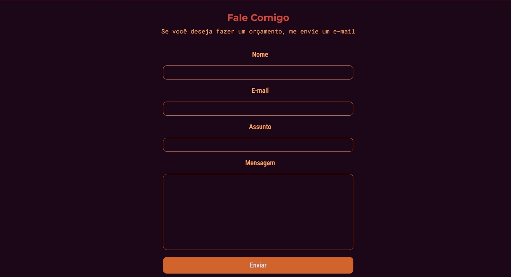
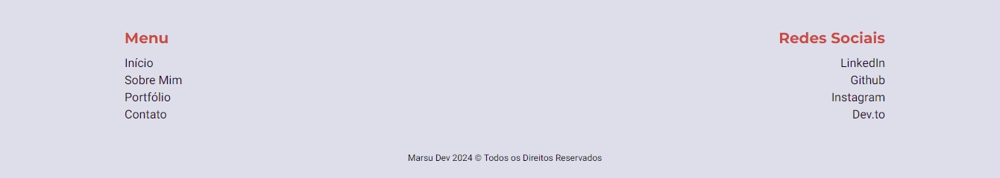

# Landing Page 

* Minha Landing Page onde faço a indexagem dos meus artigos, projetos e redes sociais ligados à programação e  desenvolvimento.

# Tópicos

- [Screenshots](#screenshots-das-versões-mobile-e-desktop)
    - [Landing Page v. Mobile](#mobile)

# Screenshots das versões Mobile e Desktop

## * Mobile:

* Versão Mobile do site.

## * Desktop:

* Versão Desktop do site.

### * Home:

* Captura de Tela da Home do site.

### * Skills:

* Captura de Tela com o efeito de profundidade no hover. Futuramente adicionarei mais linguagens e frameworks utilizando um carrossel para exibir outras tecnologias.

### * Portfolio:

* Futuramente preencherei esses exemplos com projetos reais, linkando a página do projeto dentro do site.

### * Contato:

* Formulário de contato para orçamento.

### * Formulário Preenchido com exemplo:

* Exemplo de como preencher o formulário.

### * Rodapé:

* Rodapé do site.
